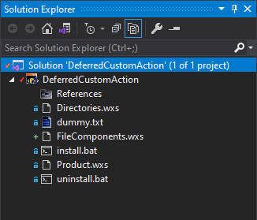
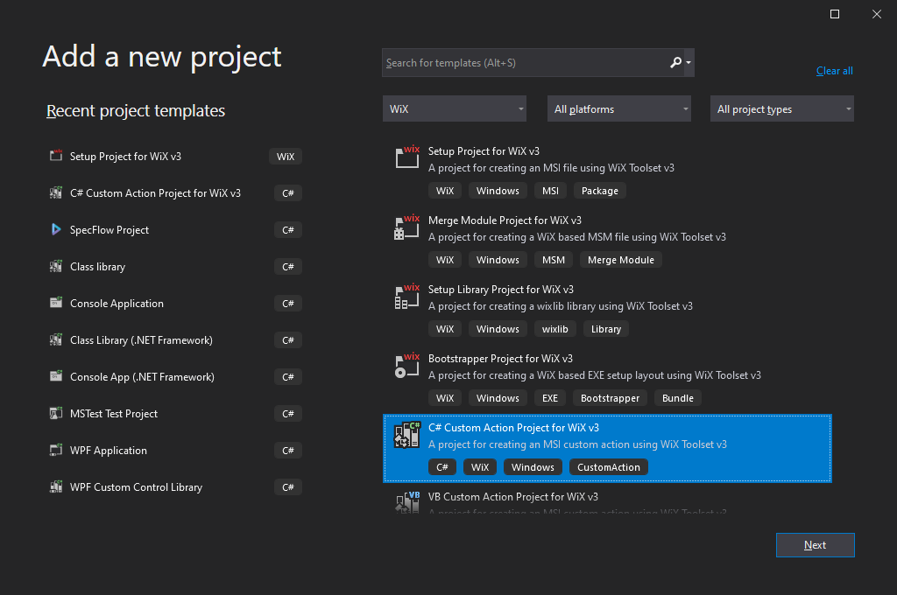
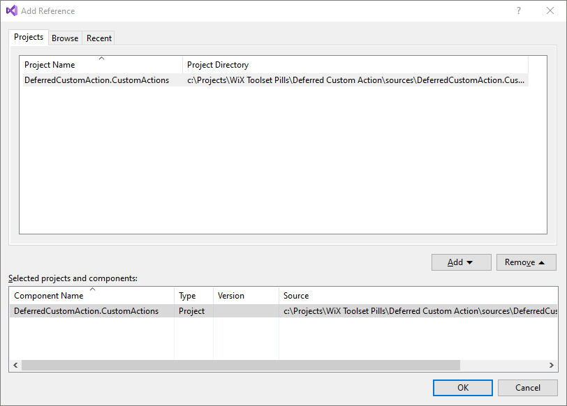
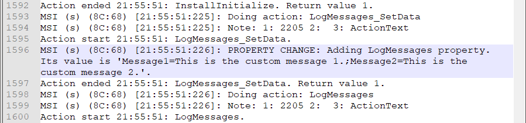
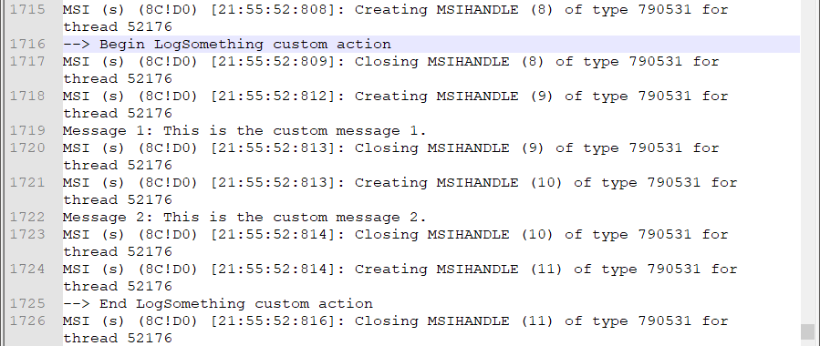

# Deferred Custom Action

## Description

The implementation of a deferred custom actions is not executed when the deferred custom action is encountered in the execution sequence. Instead, it is placed into a list of deferred custom actions and executed later, at the end of the installation sequence by the `InstallFinalize` custom action.

## Implementation

In this example we'll create a deferred custom action that writes into the log file a couple of messages provided from the console.

Let's begin.

### Step 0: Prerequisites

Create a simple installer project called "DeferredCustomAction" that deploys a single dummy file.



See the "My First Installer" pill for an example:

- [My First Installer](https://github.com/WiX-Toolset-Pills-15mg/My-First-Installer)

### Step 1: Create the MESSAGE properties

First, we'll create a couple of properties that will be sent, later, to the custom action's implementation in order to write them into the log file.

```xml
<Property Id="MESSAGE1" Value="This is the first message." />
<Property Id="MESSAGE2" Value="This is the second message." />
```

**Note**: The properties are upper case. By convention, WiX Toolset treats all uppercase properties as `public` so they can be provided from command line.

### Step 2: Create the C# custom actions project

Next, let's create the C# project containing the custom action's implementation.

Right click on the solution in Solution explorer -> Add - New Project... -> choose "C# Custom Action Project for WiX v3" -> Set Project Name: "DeferredCustomAction.CustomActions" -> Create



A custom action project is a class library with additional msbuild targets that create the `*.CA.dll` file as a wrapper over the normal .NET dll assembly. This is necessary because Windows Installer is not able to consume .NET assemblies directly. This `*.CA.dll` acts as an adapter.

**Note**: Because of this, make sure to always create a project of type "C# Custom Action Project for WiX v3" and not a normal class library project.

### Step 3: Create the custom action function

#### The function signature

Create a public static method having the `[CustomAction]` attribute on it. This is the function referenced in the custom action tag from WiX.

```csharp
public class LogSomethingCustomAction
{
    [CustomAction("LogMessages")]
    public static ActionResult Execute(Session session)
    {
        ...
    }
}
```

The name of the custom action can be provided as parameter. In this case, it is `LogMessages`. If it is not provided explicitly, it will be the name of the function itself, in this example, `Execute`.

Another detail worth to be mentioned is that the method must receive a parameter of type `Session`.

#### The implementation

Let's add the implementation. We said we want to log the two parameters, `MESSAGE1` and `MESSAGE2`.

If this function would be used by an immediate custom action, the property values would be retrieved like this:

```csharp
string message1 = session["MESSAGE1"];
string message2 = session["MESSAGE2"];
```

But, being used by a deferred custom action, and executed at the end of the installation, this function cannot access the session properties anymore as shown above. We'll need a different mechanism.

WiX Toolset provides a way of sending values to the deferred custom action (we'll see later how) and they are retrieved in C# using the `CustomActionData` collection like this:

```csharp
string message1 = session.CustomActionData["Message1"];
string message2 = session.CustomActionData["Message2"];
```

The complete implementation of the function is:

```csharp
[CustomAction("LogMessages")]
public static ActionResult Execute(Session session)
{
    session.Log("--> Begin LogSomething custom action");
    try
    {
        string message1 = session.CustomActionData["Message1"];
        session.Log("Message 1: " + message1);

        string message2 = session.CustomActionData["Message2"];
        session.Log("Message 2: " + message2);

        return ActionResult.Success;
    }
    finally
    {
        session.Log("--> End LogSomething custom action");
    }
}
```

### Step 4: Reference the custom action library

A reference to the library file (`*.CA.dll` file) that contains the custom actions must be added to the installer:

   - Right click on the installer project -> Add -> Reference... -> Projects -> [the custom actions project] -> Add -> OK



A custom actions project for WiX created in C# will generate two files:

   - `<name>.dll` - a normal .NET class library assembly.
- `<name>.CA.dll` - a wrapper over the previously created .NET assembly that can be consumed by Windows Installer.
  This trick is needed because, natively, Windows Installer cannot consume .NET assemblies.

### Step 5: Add the `<Binary>` tag

The `<Binary>` tag provides an alias for the dll that contains the implementation of the custom actions. Because it needs the path to the `*.CA.dll` file created by the custom actions project, we are tempted to write the tag like this:

```xml
<Binary
    Id="CustomActionsBinary"
    SourceFile="$(var.SolutionDir)Kata_20220127.CustomActions\bin\Debug\Kata_20220127.CustomActions.CA.dll" />
```

But, it is not a good practice to hard-code the path. What will we do when we build in Release mode for example?

WiX Toolset helps us here with a number of variables created automatically when we reference the custom actions library. Two of them that we can use here are:

- `var.DeferredCustomAction.CustomActions.TargetDir`
  - contains the path to the custom action's dll. (That `bin\Debug` or `bin\Release` where the project is built.)

- `var.DeferredCustomAction.CustomActions.TargetName`
  - contains the name of the custom action's assembly. This is the name of the file without extension.

Let's rewrite the `<Binary>` tag using those variables:

```xml
<Binary
    Id="CustomActionsBinary"
    SourceFile="$(var.DeferredCustomAction.CustomActions.TargetDir)$(var.DeferredCustomAction.CustomActions.TargetName).CA.dll" />
```

### Step 6: Create the deferred custom action

A deferred custom action declaration is very similar with an immediate custom action, but it has its `Execute` attribute set to `deferred`.

```xml
<CustomAction
    Id="LogSomething"
    BinaryKey="CustomActionsBinary"
    DllEntry="LogSomething"
    Execute="deferred" />
```

Similar to an immediate custom action, it also requires the two attributes that identifies the C# function containing the actual implementation:

- The `BinaryKey` - specifies the library file;
- The `DllEntry` - specifies the function containing the implementation.

### Step 7: Create the data custom action

As we specified before, a deferred custom action cannot access the properties, so we need another way to send the needed values to the custom action's implementation. This is done using a second custom action that creates a property with the same name as the deferred custom action:

```xml
<CustomAction
    Id="LogSomething_SetData"
    Property="LogSomething"
    Value="Message1=[MESSAGE1];Message2=[MESSAGE2]"/>
```

- `Id` attribute
  - **Naming Convention**: As a convention, I prefer to name this second custom action with the same name as the associated deferred custom action, but append the `_SetData` to it. I choose this naming convention because it provides the data for the `CustomActionData` collection used in C#.

- `Property` attribute
  - Must have the same name as the deferred custom action.
- `Value` attribute
  - Contains a key-value list with the arguments separated by semicolon.

### Step 8: Sequence the custom actions

It is time to add the custom actions into the execution sequence. Note that the associated custom action, the one that sets the data must be scheduled before its deferred custom action.

```xml
<InstallExecuteSequence>
    <Custom Action="LogMessages_SetData" Before="LogMessages" />
    <Custom Action="LogMessages" After="InstallInitialize" />
</InstallExecuteSequence>
```

That's it. Now, let's build and run the installer.

### Step 9: Run the installer

Install the MSI and look into the "install-with-messages.log" file.

#### `LogMessages_SetData` custom action

First, let's search for the `LogMessages_SetData` custom action. We find it executed before the `LogMessages` custom action as we scheduled it:



Note that it sets the property called: `LogMessages`.

#### `LogMessages` custom action

Regarding the `LogMessages` custom actions we can observer the followings:

- It is executed after the `LogMessages_SetData`.
- Both custom actions are executed before `InstallInitialize`.
- The c# implementation is not executed here. The log messages written from C# are not present here.

#### `InstallFinalize` custom action

We actually find those messages down in the log file, inside the `InstallFinalize` execution. This confirms what we already know, that the implementation of the deferred cutom action is not executed right away, but it is added in a list of deferred custom actions and executed by `InstallFinalize` at the end of the installation.


